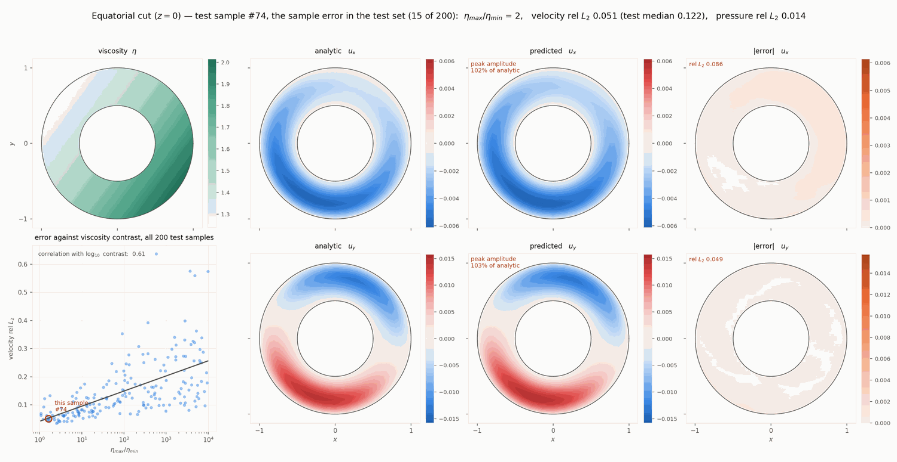

# terra-ml

A neural operator that learns the Stokes solution map on the TERRA-NG spherical shell,
together with the data generation it trains on and the solver-side hook that calls it.

    (f_u, f_p, eta)  ->  (u, p)

* `terra_data` — manufactured Stokes problems. Random polynomial solutions with the
  right-hand sides derived analytically in sympy against *the same* deviatoric operator
  TERRA implements, verified to reproduce the code's own analytic test cases with
  symbolically zero difference.
* `terra_infer` — the operator, its training driver, the finite-difference Stokes
  residual used as a physics loss, and the mesh symmetry group used for augmentation.

## Install

    pip install -e python/

This puts `terra_data` and `terra_infer` on the path for the batch scripts and for the
embedded interpreter in `terra::ml::NeuralSolver`.

## The spectral operator

The model lives in `terra_infer.operator` (`terra_infer.wavelet3d` and
`terra_infer.train_wavelet3d` remain as import shims — the old name reflected the
retired wavelet ancestry, not the architecture). It is a stack of pointwise layers
coupled by a **spectral branch**, and every
component is either pointwise or acts on a fixed set of modes:

    lift  Linear(13 -> 256) -> GELU -> Linear(256 -> 128)        pointwise
    8 x   x = x + merge(cat[x, branch(LayerNorm(x))])
          x = x + MLP(LayerNorm(x))                              pointwise
    head  LayerNorm -> {Linear(128->128)->GELU->Linear(128->3),  pointwise
                        Linear(128->128)->GELU->Linear(128->1)}

The 13 lift inputs are the momentum right-hand side (3), the continuity right-hand side,
log viscosity, and four geometry channels (Cartesian position and normalised depth), plus
optional derived channels `grad log eta` and `div f_u`.

Inside the branch, the field is transformed to a basis in which an elliptic operator is
nearly diagonal — spherical harmonics are the eigenfunctions of the Laplacian on a sphere:

    (B, 128, n_lat, n_rad)
      -> spherical-harmonic analysis   (lateral)      (B, 128, 289, n_rad)
      -> Chebyshev analysis            (radial)       (B, 128, 289, 9)
      -> mode-coupling attention over the 289 (l,m) tokens, banded |l-l'| <= 8,
         one module shared by all layers, zero-initialised residual
      -> block-diagonal channel mixing, 8 groups of 16, with weights indexed by
         the harmonic DEGREE l ("per-degree")
      -> synthesis back                               (B, 128, n_lat, n_rad)

Two refinements over the plain mode-shared branch, both earned against ablations:

*Per-degree weights.* For radially symmetric viscosity the operator is rotationally
invariant, so its transfer function depends on l alone — degree-indexed weights are
the correct symmetry class, and they let the branch express a per-degree response
like the 1/(l(l+1)) of an inverse Laplacian, which mode-shared weights cannot.
The mode count is fixed by the truncation, not the mesh, so the degree index costs
no invariance. L = 16 is the sweet spot on level-3 data (an inverted U: 0.1296 /
0.1233 / 0.1282 / 0.1336 for L = 12/16/20/22); the hard ceiling is L = 22, where
(L+1)^2 approaches the 642 distinct lateral nodes and the analysis goes singular.
The same Nyquist logic caps the radial truncation at K = 8 on 9 shells — K = 12
matches natively and then transfers at 0.62, pure aliasing.

*Banded mode-coupling attention.* Laterally varying viscosity couples modes — a
viscosity component of degree l_eta couples velocity degrees within |l - l'| <= l_eta
(the triple-product selection rule) — and any diagonal-in-mode weights are blind to
it. Self-attention among the coefficient tokens supplies the data-dependent
off-diagonal correction; the band mask removes the couplings the physics forbids,
one module shared across layers keeps it at 0.59M parameters (the free-form
per-layer version, 4.7M, fits the training set better and generalises worse), and
its parameters run at a 10x lower peak learning rate, without which it diverges at
warmup. Worth ~4% natively and 13-17% under mesh transfer.

Analysis uses the pseudo-inverse of the basis rather than a quadrature rule, because
nodes shared between diamonds are stored once per subdomain and a quadrature would
double-count the seams. Both transforms are exact for band-limited fields (verified to
5e-8 laterally and 1.6e-8 radially). The shell is an exact radial extrusion, so one
lateral transform serves every radial shell.

### Why it is discretisation invariant

Every learned weight is indexed by channel, degree, or mode-token — never by node —
and the token count is fixed by the basis truncation rather than by the mesh.
Refining the grid changes only the transform matrices (lateral synthesis goes from
(810, 289) to (10890, 289)) while every weight and the (289 x 9) coefficient tensor
stay the same, so the same weights run natively on any refinement.

The remaining transfer error is discretisation *extrapolation* — a level-3-only
model has never seen its transforms at another resolution. Training the same
weights on two meshes at once removes it (`train_multires`, swapping the
mesh-dependent buffers per batch), and the largest single win of all is simply
data: at 1k samples every variant is starved. The current best model
(`train_multires`, per-degree L = 16 + banded shared coupling, 10k level-3 +
1k level-4 samples, checkpoint selected on the WORST resolution):

| mesh | velocity nodes | relative L2 (u) |
|---|---|---|
| level 3 (trained) | 7,290 | 0.072 |
| level 4 (trained) | 49,130 | 0.066 |
| level 5 (never seen) | 359,370 | 0.055 |

The error now *falls* toward the finer mesh; the level-3-only ancestors of this
model went 0.15 -> 0.26 in the same comparison. Ablations at 10k samples,
single-level training: per-degree alone 0.055 / 0.166 / 0.193; + coupling
0.060 / 0.144 / 0.173; + multires gives the table above. Pressure is below 0.05
everywhere. 2.05M parameters.

## Pipeline

### 1. Generate a dataset

Dump the mesh, then build the samples. Both are per-level; generation shards trivially.

    mpirun -np 1 ./stokes_dataset_tool --max-level 3 --min-level 2 --outdir $DIR
    python -m terra_data.generate --dir $DIR --num-train 1000 --num-test 200 \
        --max-degree 4 --contrast-min 1 --contrast-max 1e4 --seed 42 \
        --shard $i --num-shards 16

Samples are seeded per index, so sample *i* is the same analytic function at every
resolution — which is what makes cross-level comparison meaningful. Each sample is
normalised so `rms(f_u) = 1`; `u` and `p` scale with it, leaving the physics exact.

Datasets are large and regenerable — put them in an hpc-workspace, not in `$HOME`.

To check the generator against TERRA itself:

    python -c "from terra_data.stokes_symbolic import validate_against_terra_testcase as v; v()"
    python -c "from terra_infer.stokes_residual import validate; validate()"

### 2. Train

Single-level, the full recipe of the current best architecture:

    python -m terra_infer.train_operator --data $DIR --epochs 240 \
        --no-wavelet --spherical 16 --radial-modes 8 --sph-per-degree \
        --sph-couple --sph-couple-band 8 --sph-couple-shared \
        --symmetry-aug --physics-weight 2 --fine-continuity \
        --grad-log-eta --div-fu --mean-free-target --head-mlp \
        --mean-p-weight 1.0 --momentum-margin 2 --hidden 128 --layers 8

Mixed-resolution — the configuration behind the results table above; each batch
comes from one of the listed datasets and `set_mesh` swaps the geometry, harmonic
and Chebyshev buffers between them while the weights stay shared:

    python -m terra_infer.train_multires \
        --data $L3_10K_DIR $L4_DIR --eval-data $L3_10K_DIR $L4_DIR $L5_DIR \
        --epochs 240 --no-wavelet --attention softmax \
        --spherical 16 --radial-modes 8 --sph-per-degree \
        --sph-couple --sph-couple-band 8 --sph-couple-shared \
        --symmetry-aug --physics-weight 2 --mean-p-weight 1.0

The loss is a relative L2 on velocity and mean-free pressure, plus the **Stokes residual**
evaluated by finite differences on the real mesh with its inverse Jacobian:
`||A u + grad p - f_u|| / ||f_u||` and `||div u - f_p|| / ||f_p||`, both on interior nodes.
Being relative makes every term scale-free, so they compose without unit tuning.

`--symmetry-aug` applies a random element of the mesh's exact symmetry group — the five
2*pi/5 polar rotations, which permute nodes with zero interpolation error, times the sign
flip that linearity provides. Worth -32% at a matched epoch budget, and free.

### 3. Test

    python -m terra_infer.train_operator --data $DIR --eval-only model.pt \
        --no-wavelet --spherical 12 --radial-modes 8 --hidden 128 --layers 8 \
        [--tta] [--dump-predictions preds.npz]

reports velocity and pressure relative L2, the momentum and continuity residuals, and the
error on the no-slip boundary. `--tta` averages the prediction over the whole symmetry
group, mapping each element back before averaging.

Note the momentum residual has a floor: the finite-difference operator applied to the
*true* fields scores 0.058, so values below that measure discretisation, not accuracy.

### 4. Run it on a finer mesh

Nothing needs retraining. Point the model at the other mesh and evaluate:

    from terra_infer.operator import Model, load_state
    net = Model(9, 4, (9, 9, 9), n_hidden=128, n_layers=8, coords=coarse_coords,
                head_mlp=True, spherical=16, radial_modes=8, wavelet=False,
                per_degree=True, sph_couple=True, sph_couple_band=8,
                sph_couple_shared=True)
    load_state(net, torch.load("model.pt")["model"])
    net.set_mesh((33, 33, 33), fine_coords)      # rebuilds the transforms, keeps weights
    u_p = net(fields)                            # (S, 33, 33, 33, 4)

The architecture switches are recorded in every checkpoint, so a loader can read
them back instead of hardcoding (`ck["spherical"]`, `ck["per_degree"]`,
`ck["sph_couple"]`, ...).

### 5. Call it from the solver

Build with `-DTERRA_ENABLE_PYTHON=ON` and use `terra::ml::NeuralSolver`, which satisfies
`SolverLike`. Fields cross into Python zero-copy through the buffer protocol, and the
prediction is made consistent across subdomains before it is returned. Reachable from the
test driver as `test_epsilon_divdiv_stokes --neural-solver <model>`.

## Predictions

The figures below are from the earlier mode-shared spectral baseline (0.15 at
level 3) and predate the per-degree/coupling/multires model documented above; the
qualitative picture — viscosity contrast as the dominant difficulty — still holds,
with the coupling attention aimed at exactly that failure mode.

Equatorial cut on the easiest and hardest test samples. Analytic and predicted share a
colour scale per component, so amplitude damping stays visible; the error panel uses the
same scale again, so a faint panel means a genuinely small error.

Easiest, sample #74 — viscosity contrast 1.6, relative L2 0.051:

Hardest, sample #47 — contrast 3696, relative L2 0.575:

Viscosity contrast is the dominant remaining difficulty: error correlates with it at 0.61
across the test set, and concentrates in the low-viscosity channels — within sample #47,
0.80 in the softest viscosity decile against 0.27 in the stiffest.
